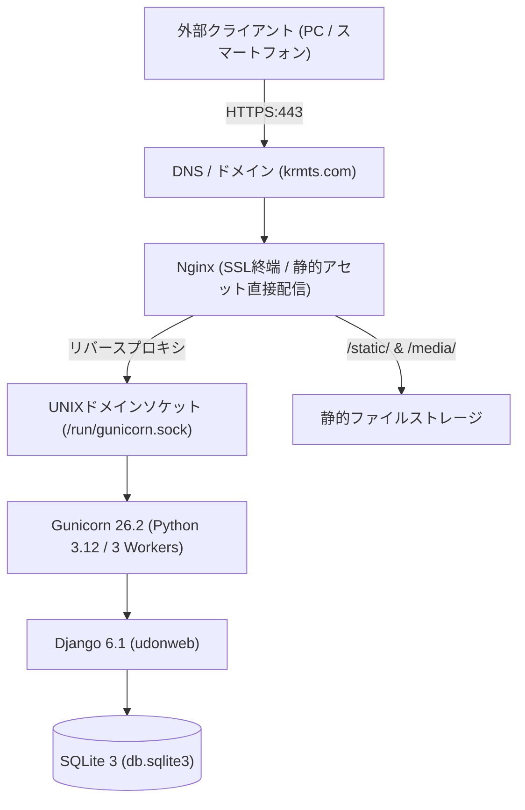

# krmts.com Webプラットフォーム (udonweb) 🌐

さくらのVPS（AlmaLinux 10.2 / Python 3.12 / Django 6.1）上で稼働する、生活・趣味・作業を豊かにする3大Webアプリケーション統合プラットフォームです。  
Nginx リバースプロキシ、Gunicorn（UNIXドメインソケット）、Let's Encrypt SSL、および Net-SNMP + MRTG リソース監視基盤のもと、24時間365日安定稼働しています。

---

## 📱 稼働アプリケーション一覧

| アプリケーション | URLパス | 概要 | 認証システム |
| :--- | :--- | :--- | :--- |
| **讃岐うどん巡礼システム** 🍜 | [`/udon/`](https://krmts.com/udon/) | 香川のうどん食べ歩き計画、Google Maps巡回マップ、5軸レーダーチャート、公式マスコット「うどんちゅ」 | ワンタップニックネーム認証（パスワード不要・即時切替） |
| **たびしお（旅ナビ）** ✈️ | [`/travel/`](https://krmts.com/travel/) | 全国の複数日程旅行計画、6大交通ダイヤ所要時間自動計算、印刷対応しおり閲覧、思い出写真共有 | **メールアドレス認証＆本登録制（うどんアプリから完全分離）** |
| **Pomodoro Focus** 🍅 | [`/pomodoro/`](https://krmts.com/pomodoro/) | 作業集中タイマー、YouTube LIVE/アーカイブBGM、時報カウントダウン音響、集中ヒートマップ草カレンダー | 完全クライアントサイド駆動（DBレス・高速） |

---

## 🌟 各アプリケーションの主要機能

### 1. 讃岐うどん巡礼システム (`/udon/`)
- **うどん旅ルートマップ**: Google Maps上に巡回予定店舗をピン留め＆ルート結線表示、移動時間の自動計算
- **5軸うどんレビュー & レーダーチャート**: コシ、出汁、情緒、天ぷら、コスパ（各10点満点）の動的Chart.js評価
- **ソーシャル & コミュニティ**: レビューへのいいね、返信コメント、ベルマーク新着通知、お気に入り（★）
- **UI/UX**: 和モダン＆Glassmorphismデザイン、公式マスコット「うどんちゅ」による演出、PWA対応

### 2. たびしお（旅ナビ） (`/travel/`)
- **独立した安全な認証システム**:
  - 新規仮登録（`/travel/register/`）➔ ワンタイム暗号化トークン付き確認メール送信
  - メール内リンククリックによる本登録アクティベーション（`/travel/activate/<uidb64>/<token>/`）
  - メールアドレス ＋ パスワードによる本格ログイン（`/travel/login/`）
  - 専用プロフィールモデル `TravelProfile`（ニックネーム、アバターカラー、自己紹介）
- **複数日程（Day 1 〜 Day N）自動同期**: 旅行期間の変更に合わせて日程スケジュールを自動再配置
- **6大交通手段とダイヤ自動計算**: 🚗車、🚃新幹線、✈️飛行機、🚌バス、🚶徒歩、🚢船の移動所要時間を即時算出
- **旅のしおり閲覧モード（Guide View）**: スマホ片手に見やすい縦スクロールタイムライン、A4印刷最適化CSS（`@media print`）
- **スポット思い出写真共有**: 各立ち寄りスポットに参加メンバーが撮影写真をリアルタイム投稿

### 3. Pomodoro Focus (`/pomodoro/`)
- **時報カウントダウン音響**: ジャスト1.0秒等間隔・残り3秒/2秒/1秒の予告「ポッ」3回＋0秒到達時「ポーーーーーーン」正報ベル（Web Audio APIによる完全合成）
- **YouTube LIVE生配信 & アーカイブ完全対応**: 生配信検知・赤色パルスLIVEバッジ、DVR巻き戻し・最新追いつく機能
- **シームレスプレイヤー**: 背景全画面／小窓PIPの切り替え時にも動画が途切れず続きから維持されるCSSモーフィング
- **集中ヒートマップ & ストリーク**: GitHub風18週集中アクティビティ草カレンダー、5段階カラー、連続達成日数
- **スマホバックグラウンド再生**: Media Session API連携によるロック画面・通知領域からの再生/停止操作対応

---

## 🛠 技術スタック & 全体インフラ構成



- **OS / ホスト**: AlmaLinux 10.2 (x86_64) on さくらのVPS (`ik1-221-80829.vs.sakura.ne.jp`)
- **Webサーバー**: Nginx 1.2x (Let's Encrypt 自動更新SSL)
- **WSGIサーバー**: Gunicorn 26.2.0 (systemd socket activation)
- **言語 & フレームワーク**: Python 3.12.14, Django 6.1
- **データベース**: SQLite 3 (`db.sqlite3` / WALモード)
- **メール配信機構**: Django 6.1 `MAILERS` 設定（ファイル保存 / SMTP自動切替）
- **リソース監視**: Net-SNMP 5.9 + MRTG 2.17（CPU / メモリ / トラフィック5分自動集計）

---

## 🌿 Gitブランチ運用ルール (Feature Branching)

本リポジトリでは、本番環境の安定性と開発トレーサビリティを担保するため、以下のブランチ運用を徹底しています：

1. **Featureブランチの作成 & リモート同期**:
   - 新機能の開発や不具合修正時は、必ず `main` からブランチを分岐：
     ```bash
     git checkout -b feature/<feature-name>
     git push -u origin feature/<feature-name>   # GitHub上にも必ずブランチを残す
     ```
2. **実装・検証**:
   - 当該ブランチ上で実装、ローカルテスト、結合テストを実施。
3. **マージ & プッシュ**:
   - 検証完了後、`main` ブランチへマージして GitHub（`origin/main`）へプッシュ：
     ```bash
     git checkout main
     git merge feature/<feature-name>
     git push origin main
     ```
   - **GitHub側のFeatureブランチはレビュー・履歴確認用としてリモートに残します**。

---

## 🚀 デプロイ・保守コマンド

```bash
# 1. 仮想環境のアクティベート
source /home/administrator/udonweb/venv/bin/activate

# 2. 静的ファイルの集約
python manage.py collectstatic --noinput

# 3. データベースマイグレーション
python manage.py migrate

# 4. Gunicornサービスの再起動（反映）
echo "<sudo_password>" | sudo -S systemctl restart gunicorn
```

---

## 📑 関連ドキュメント（Obsidian Vault）

サーバーの詳細仕様書は、ローカルObsidian Vault（`news/System/`）にて常時最新化・同期されています：
- `news/System/krmts.com Webサーバー・インフラ構成設計書.md`
- `news/System/讃岐うどん巡礼システム 詳細設計書 - 香川うどん旅計画・評価プラットフォーム.md`
- `news/System/旅ナビ (TabiNavi) 詳細設計書 - 複数日程・交通ダイヤ対応旅行しおりシステム.md`
- `news/System/Pomodoro Focus (ポモドーロ＆YouTube BGM) 詳細設計書.md`
- `news/System/krmts.com データベースER図・スキーマ設計解説書.md`
